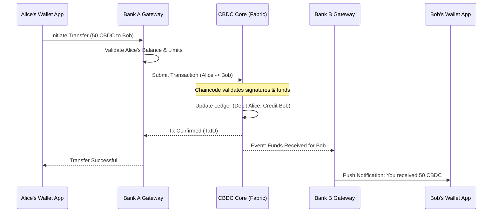
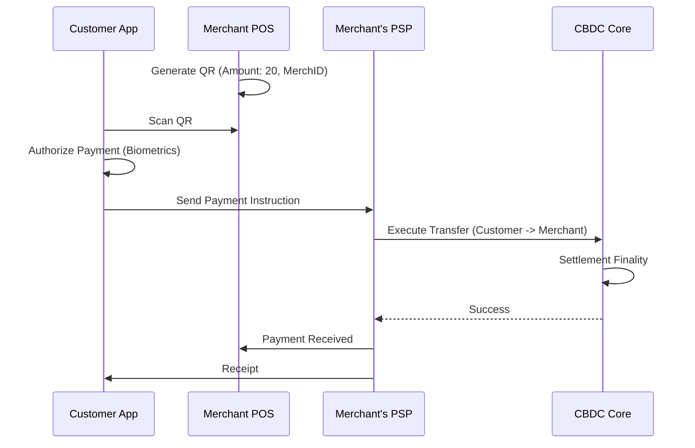
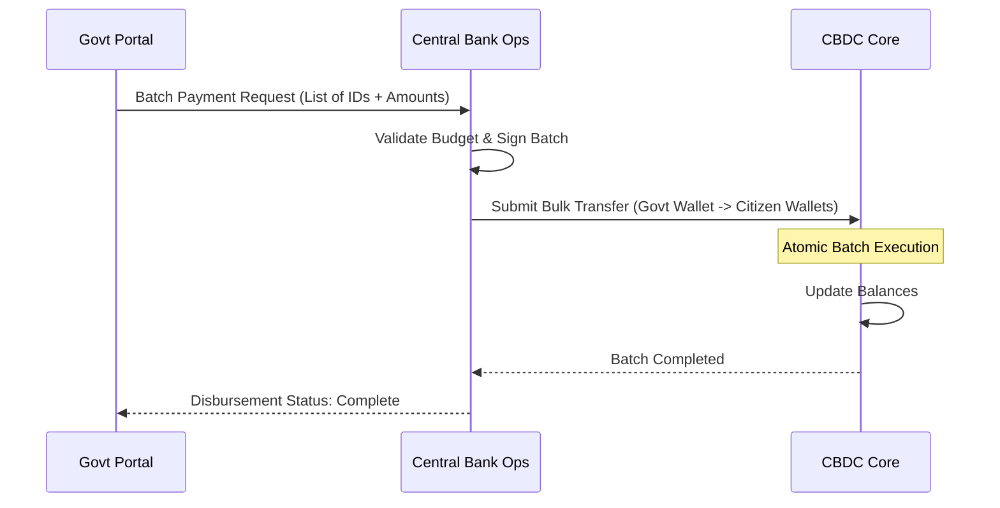

# Phase 1: High-Level CBDC System Design

## 1. High-Level Design Choices

### 1.1 Retail vs. Wholesale
- **Decision**: **Retail-Focused**.
- **Rationale**: The primary goal is to provide a digital cash equivalent for the general public (`G2P`, `P2P`, `P2B`). Wholesale settlement will be handled via integration with existing RTGS systems, but the core ledger is optimized for retail throughput and accessibility.

### 1.2 Direct vs. Intermediated
- **Decision**: **Intermediated (Two-Tier Model)**.
- **Rationale**: The Central Bank does not want to manage customer relationships, KYC, or retail support.
  - **Tier 1 (Central Bank)**: Issues CBDC, maintains the core ledger, and manages the system rules.
  - **Tier 2 (Intermediaries)**: Commercial banks and PSPs manage wallets, perform KYC/AML, and handle customer service.

### 1.3 Account vs. Token
- **Decision**: **Hybrid (Account-Based Core + Token-Like Offline)**.
- **Rationale**:
  - **Online Core**: Account-based (UTXO or Balance model in Fabric) allows for easier identity mapping, limit enforcement, and regulatory oversight.
  - **Offline**: Token-like "vouchers" or "purses" stored on secure hardware allow for peer-to-peer transfer without internet, reconciling with the account-based core when online.

### 1.4 Privacy Model
- **Decision**: **Pseudonymity with Controlled Disclosure**.
- **Mechanism**:
  - **Core Ledger**: Sees only pseudonymous addresses/keys. No PII (Personally Identifiable Information) is stored on-chain.
  - **Intermediaries**: Hold the mapping between real identities (KYC data) and on-chain addresses.
  - **Regulator/Auditor**: Can request de-anonymization from intermediaries via legal process or zero-knowledge proofs for specific compliance checks.

## 2. Layered Logical Architecture

The system is organized into 6 logical layers:

### Layer 1: Policy & Governance
- **Purpose**: Defines the rules of the game.
- **Components**: Scheme Rulebook, Governance Channel (Fabric), Policy Engine (Chaincode).

### Layer 2: Core CBDC Platform (Central Bank Zone)
- **Purpose**: The "Trust Anchor". Maintains the single source of truth for value.
- **Components**:
  - **Hyperledger Fabric Network**: Orderers, Peers, Chaincode.
  - **Mint/Burn Service**: Managing total supply.
  - **Notary/Double-Spend Check**: Preventing duplication.
  - **Data Warehouse**: Anonymized transaction history for analytics.

### Layer 3: Intermediary & Services Layer
- **Purpose**: Distribution and Innovation.
- **Components**:
  - **Intermediary Nodes**: Fabric peers run by banks (optional but recommended for trust).
  - **Gateway Services**: API layer connecting Core to Wallets.
  - **KYC/AML Systems**: Integration with legacy bank systems.

### Layer 4: Access & Wallet Layer
- **Purpose**: User Interaction.
- **Components**:
  - **Mobile Wallets**: iOS/Android apps for citizens.
  - **Merchant POS**: QR code scanners, NFC terminals.
  - **Web Portals**: For corporate banking and government disbursements.

### Layer 5: Data, Risk & Analytics
- **Purpose**: Insight and Security.
- **Components**: Fraud Detection System, Liquidity Monitoring, Regulatory Reporting Dashboards.

### Layer 6: Cross-Cutting (Security & Ops)
- **Purpose**: Reliability and Protection.
- **Components**: IAM/PKI, HSMs, CI/CD Pipelines, Logging & Monitoring.

## 3. Example Payment Flows

### 3.1 Retail P2P Transfer (Alice -> Bob)
**Scenario**: Alice (Bank A) sends 50 CBDC to Bob (Bank B).

### 3.2 Merchant Payment (Consumer -> Merchant)
**Scenario**: Customer scans Merchant QR code to pay 20 CBDC.

### 3.3 G2P Payment (Government -> Citizen)
**Scenario**: Government disburses social benefit to 1000 citizens.

